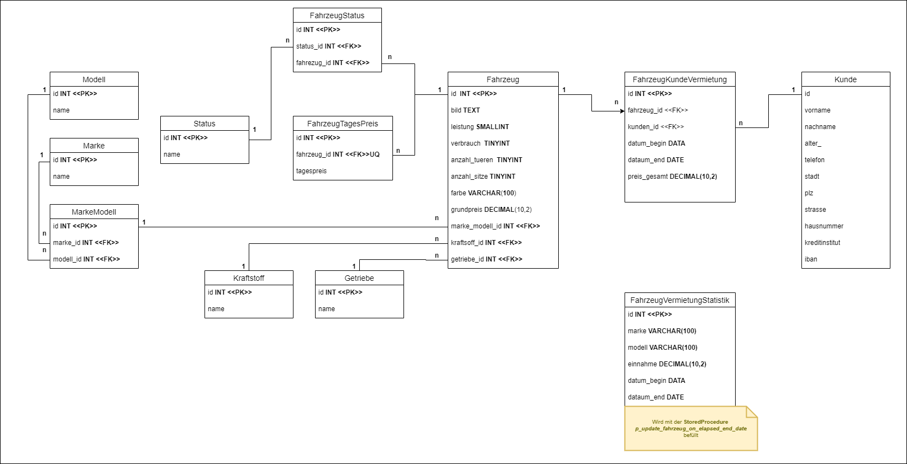
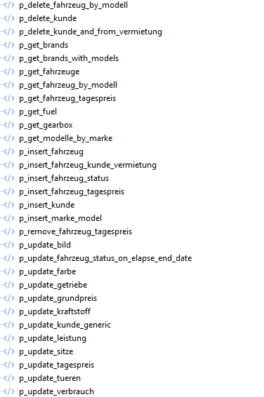
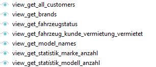

# Projektarbeit JAVA III

---
## Anwendung: FuhrparkExplorer

---
### Fachinformatiker Anwendungsentwicklung FIAE 24

> **Autor**: Michael Saracen

> **Dozent**: Sven Lilienthal

> **Datum**: vom  16.06.2025 bis 27.06.2025

---


## Inhalt


1. [Beschreibung des Auftrags](#beschreibung-des-auftrags)
2. [Hinweise zur verwendetetn Hard- /Software](#hinweise-zur-verwendetetn-hard--software)
   - [**Hardware**](#hardware)
   - [**Software**](#software)
3. [Ressourcenplaung](#ressourcenplaung)
4. [Kostenkalkulation](#kostenkalkulation)
5. [Prozesssschritte und Egebnisse](#prozesssschritte-und-egebnisse)
    - [**Analyse**](#analyse)
    - [**Entwurf**](#entwurf)
    - [**Realisierung**](#realisierung)
    - [**Fazit**](#fazit)
6. [Anhang](#anhang)
   - [LoadAtStartRunnable](#loadatstartrunnable)
   - [Database](#database)
   - [Sequenzdiagramme](#sequenzdiagramme)
   - [UML - Klassendiagramm](#uml-klassendiagramm)
   <br>

---

## [Beschreibung des Auftrags](#projektarbeit-java-iii)

In Bezug auf das Telefonat vom 16.06.2025 mit dem Herrn **Nicht Deine-Kragenweite**, wurde beschlossen, dass eine
Anwendung zur Verwaltung von **Fahrzeugen** und **Kundendaten** erstellt werden soll.
Hierbei wurde insbesondere auf eine **persistente Datenspeicherung** fokus gelegt, mit einer **MySQL** Database.
Denn auch die Anforderung, für einen Mehrbenutzerbetrieb ist Priorität. 
Die Oberfläche soll interaktiv und leicht zu bedienen sein. Eine Aufteilung von Ansichten wie Tabellen, Listen und
Baustrukturen sollen hier sinnvoll platziert und dementsprechend passend zur Ansicht funktional im Kontext stehen.
Ein Login Fenster soll zum Beginn der Anwendung erscheinen, um Benutzerdaten abzufragen.
Bei einem Erfolgreichen Login, sollen alle nötigen Infomrationen in die Ansichten geladen werden und sofort zur
Verfügung stehen.
Eine Aufteilung von **navigierbaren** Seiten ist wie folgt vorzufinden:

- **Start**: Die Landing Page
- **Vermietung**: Eine Ansicht mit Tagespreisen, Kundenauswahl um eine ID zuerörtern und eine Kalendaransicht mit anschließendem **vermieten** Button.
- **Vorschau**: Eine Komplettübersicht der Fahrzeuge. Diese können entfernt oder bearbeitet werden.
- **Status**: **vermietet**, **verfügbar** und **in Reparatur** zeigen den Status der Farhzeugs in einer Baumstruktur an.
- **Gebucht**: Tabelarische Ansicht, die Kundeninformationen und Fahrzeugdaten enthält.
- **Historie**: Nach Abgabe des Fahrzeugs, Einträge in eine Liste, welche Fahrzeuge **vermietet** wurden.
- **Statistik**: Welche Marken und Modelle werden am häufigsten ausgeliehen? Wieviele Fahrzeuge sind in der Reparatur, verfügbar und vermietet.
- **Kunden**: Tabelle mit Kundeninformationen. Die Kunden können entfernt werden oder auch bearbeitet.


---

## [Hinweise zur verwendetetn Hard- /Software](#projektarbeit-java-iii)

### [Hardware](#projektarbeit-java-iii)

Zur Verfügung stand ein Desktop-PC mit zwei Monitoren.

> 🔁 CPU: AMD Ryzen 7 3800X 8-Core Prozessor

> 🔁 GPU: NVIDIA GeForce RTX 2070 SUPER

> 🔁 Arbeitsspeicher: 64GB

> 🔁 Datenträger: WD BLACK SN770 1TB

> 🔁 Mechanische Tastatur für komfortables Tippen

> 🔁 Gaming-Maus mit bis zu 16 000 DPI


### [Software](#projektarbeit-java-iii)

Alle Python-Skripte wurden mit PyCharm 2025.1.1.1 geschrieben.
Grafische UI-Elemente wurden im QtDesigner als ***.ui** erstellt und im terminal in PyCharm  mit dem command `pyside6-uic`
in **.py** Files übersetzt.
Für die MySql Datenbank wurde **HeidiSql** verwendet, da diese sehr einfach zu bedienen ist und eine große Hilfestellung bietet.

---

## [Ressourcenplaung](#projektarbeit-java-iii)

| Rolle                     |   Aufwand | Beschreibung                                         |
| ------------------------- |----------:| ---------------------------------------------------- |
| Entwickler                |      35 h | Implementierung von GUI, DB-Anbindung, Logik         |
| UI/UX-Designer            |      15 h | Mockups im QtDesigner, Benutzerführung               |
| Datenbank-Administrator   |      15 h | Datenbankmodellierung, Einrichtung der MySQL-Instanz |
| Test & Qualitätssicherung |      15 h | Erstellung und Ausführung von Testfällen, Bug-Fixing |
| **Gesamt**                | **112 h** |                                                      |


---

## [Kostenkalkulation](#projektarbeit-java-iii)

Für die **Kostenkalkulation** wird ein Entwicklerstundensatz mit einer Pauschale von 39.99€ berechnet.
Zudem kommen noch Hardware und Software Kosten inkl Lizensen.

|Posten|Faktor| Satz   |Summe|
|------|------|--------|-----|
|Entwicklerkosten|80| 39.99€ |3.199,20€|
|Kosten Hardware|1| 29.99€ |29.99€|
|Kosten Software|1|139.99€| 139.99€|
|Gesamtsumme|-|-|3.369,18€|


---

## [Prozesssschritte und Egebnisse](#projektarbeit-java-iii)

### [Analyse](#projektarbeit-java-iii)

In dieser Phase wurden folgende Anforderungen ermittelt und dokumentiert:

Funktionale Anforderungen
- Persistente Datenhaltung (MySQL)
- Benutzerverwaltung mit Login/Logout

- Fahrzeug- und Kundenverwaltung (CRUD)
- Vermietungsvorgang mit Buchungslogik
- Multithreading für gleichzeitige Datenbankzugriffe

Nicht-funktionale Anforderungen
- Performance: Reaktionszeiten < 200 ms
- Zuverlässigkeit: Einsatz in Mehrbenutzerumgebung
- Skalierbarkeit: Einfache Erweiterbarkeit (z. B. zusätzliche Ansichten)

Technische Anforderungen
- Python 3.13 + PySide6 (Qt)
- QtDesigner für UI-Prototypen
- QRunnable & QThreadPool für Hintergrundaufgaben
- MySQL-Server, HeidiSQL zur Administration

### [Entwurf](#projektarbeit-java-iii)
Use-Case-Diagramme zur Visualisierung der Nutzerinteraktionen (Login, Vermietung, Verwaltung).

Klassendiagramm (UML) mit folgenden Hauptklassen

GUI-Mockups im QtDesigner:

Datenbankmodell:


### [Realisierung](#projektarbeit-java-iii)
Das Project begann am 16.06.2025 und wurde bis zum 27.06.2025 abgeschlossen. Meilensteine waren die Fertigstellung

Datenbankanbindung über DatabaseManager (Singleton-Pattern)

Multithreading:

- Ladevorgänge (z. B. Fahrzeugliste) in separatem QRunnable
- Pool in QThreadPool.globalInstance()

GUI:
- MainWindow mit QStackedWidget für navigierbare Seiten

Tests:
- Unittests für DatabaseManager und Geschäftslogik (pytest)

### [Fazit](#projektarbeit-java-iii)
Die Anwendung FuhrparkExplorer wurde innerhalb des vorgegebenen Zeitrahmens erfolgreich umgesetzt.
Erreichte Ziele:
- Stabiler Mehrbenutzerbetrieb mit persistenter MySQL-Datenhaltung
- Intuitive GUI mit klarer Navigation und schnellen Ladezeiten
- Erweiterbarkeit für künftige Features (z. B. Rechnungserstellung)

Herausforderungen:
- Synchronisation von Threads bei gleichzeitigem Datenbankzugriff
- Optimierung der UI-Reaktionszeiten bei großen Datenmengen

Ausblick:
- Integration von Reporting-Tools (z. B. PDF-Export)
- Anbindung an externe Web-Services für Fahrzeug-Telemetrie
- Erweiterung um Rollen- und Rechtemanagement


---

# [Anhang](#projektarbeit-java-iii)

> Alle im Code benutzten Icons sind von https://fonts.google.com/icons

## [LoadAtStartRunnable](#projektarbeit-java-iii)
> Beim Start der Anwendung (nach erfolgreichem Login), müssen sämtliche Tabellen, Listen und Baumansichten mit
> Datensätzen befüllt werden.<br>
> Bei einer Umfangreichen Datenbankstruktur, kommt nach nicht drum herum, Tabellen aufwendig zu `JOINEN` was mit Leistungseinbußen
> einhergeht.<br>
> Um den Start flüssig zu halten, kommen hier QRunnables zum Einsatz. <br>
> Diese sind in Qt sogenannte `low-level classes`, die zwar Implementierungen erfordern, aber dafür auch mehr Kontrolle bieten.<br>
> Es werden hier separate, unabhängige `Ausführungseinheiten` gestartet, die dann zur Laufzeit die Ansichten mit Datensätzen befüllen. <br>
> Ein Threadpool kümmert sich um das Management und Wiederverwendbarkeit von diesen `Runnables` und sorgt für Effizienz 
> und Skalierbarkeit. Hierfür wird `QThreadPool.globalInstance().start(runnable)` aufgerufen.

```python
 @Slot()
 def on_load_on_start(self) -> None:
     """
     Führt beim Start Ladeoperationen aus, um Fahrzeuge, Preise, Kunden und Statistiken zu initialisieren.
     """
     runnable: LoadAtStartRunnable = LoadAtStartRunnable()
     # Fahrzeug Vorschau: Tree
     runnable.signals.carsLoaded.connect(self._ui.navigationTree.load_in_tree)
     # Vermietung: Preise
     runnable.signals.pricesLoaded.connect(self.on_prices_loaded)
     # Vermietung: Customer Liste
     runnable.signals.customersLoaded.connect(self._ui.rentFormular.customer_widget.on_add_items)
     # Customers: Tabelle
     runnable.signals.customersLoaded.connect(self._ui.customers.table.on_add_items)
     # Vermietung: ComboBoxen u.a
     runnable.signals.statusLoaded.connect(self.on_car_status)
     runnable.signals.rentedLoaded.connect(self._ui.rentedCardsByCustomers.on_add_items)
     # Statistic - Marken
     runnable.signals.statisticLoaded.connect(self._ui.statistic.on_load_statistic)
     # Statistic - Modelle
     runnable.signals.statisticModelsLoaded.connect(self._ui.statistic.on_load_statistic_model)

     # Historie befüllen
     runnable.signals.historyLoaded.connect(self._ui.history.on_load_history)
     QThreadPool.globalInstance().start(runnable)
```

## [Database](#projektarbeit-java-iii)



#### Gespeicherte Prozeduren



> Beispiel für die Abgabe eines Fahrzeugs. <br>
> Ist das **End-Datum** erreicht, werden Fahrzeuge aus der `FahrzeugKundeVermietung` herausgenommen. Diese Fahrzeuge 
> kommen zudem ist die Statistiktabelle `FahrzeugVermietungStatistik` und der Status des Fahrzeugs wird wieder auf
> `verfügbar` gesetzt. `UPDATE FahrzeugStatus SET status_id = 1` hier ist die `status_id` für `verfügbar`.

```sql
CREATE PROCEDURE p_update_fahrzeug_status_on_elapse_end_date (
   IN in_fahrzeug_id INT
)
BEGIN
    DECLARE v_marke VARCHAR(100);
    DECLARE v_modell VARCHAR(100);
    DECLARE v_preis_gesamt DECIMAL(10,2);
    DECLARE v_datum_begin DATE;
    DECLARE v_datum_end DATE;

    SELECT
        FKV.preis_gesamt, MA.name, MO.name, FKV.datum_begin, FKV.datum_end INTO v_preis_gesamt, v_marke, v_modell, v_datum_begin, v_datum_end
    FROM FahrzeugKundeVermietung FKV
    JOIN Fahrzeug FZ ON FKV.fahrzeug_id = FZ.id
    JOIN MarkeModell MM ON FZ.marke_modell_id = MM.id
    JOIN Marke MA ON MM.marke_id = MA.id
    JOIN Modell MO ON MM.modell_id = MO.id
    WHERE FZ.id = in_fahrzeug_id
    LIMIT 1;

    INSERT INTO FahrzeugVermietungStatistik (marke, model, einnahme, datum_begin, datum_end) VALUES (v_marke, v_modell, v_preis_gesamt, v_datum_begin, v_datum_end);
    UPDATE FahrzeugStatus SET status_id = 1 WHERE fahrezug_id = in_fahrzeug_id LIMIT 1;
    DELETE FROM FahrzeugKundeVermietung WHERE fahrzeug_id = in_fahrzeug_id LIMIT 1;
END
```

> Im Python-Code selbst wird mit einem `QTimer` (asynchron), alle 5 Sekunden geprüft, ob das **End-Datum** bereits erreicht wurde. <br>

```python
# MainWindow.py
__init__(self, parent: QWidget=None):
    ...
   self._elapsed_dates_timer: QTimer = QTimer(self)
   self._elapsed_dates_timer.timeout.connect(self.on_check_connection)
   self._elapsed_dates_timer.start(5000)
    ...

@Slot()
def on_check_connection(self) -> None:
  """
  Überprüft periodisch die Datenbankverbindung und reagiert auf Verbindungsfehler.
  """
  try:
      runnable: ConnectionRunnable = ConnectionRunnable()
      runnable.signals.statusOk.connect(self.on_elapsed_dates)
      runnable.signals.errorOccurred.connect(self.on_connection_error)
      QThreadPool.globalInstance().start(runnable)
  except RuntimeError as e:
      print(e)

@Slot(str)
def on_connection_error(self, _error: str) -> None:
  """
  Öffnet einen Fehlerdialog, wenn die Verbindung zur Datenbank unterbrochen wurde.
  :param _error: Beschreibung des Verbindungsfehlers
  """
  if self._error_dialog is None:
      self._error_dialog = SimpleDialog(
          "Verbindung verloren",
          "Ein **Fehler** ist aufgetreten! Die Verbindung zum MySQL - Server wurde **unterbrochen**. Überprüfe die Verbindung" ,
          self
      )
      self._error_dialog.show_buttons(False)
      self.sizeChanged.connect(self._error_dialog.resize)


@Slot()
def on_elapsed_dates(self) -> None:
  """
  Prüft, ob Mietzeiträume abgelaufen sind, setzt ggf. Status zurück und aktualisiert die Ansicht.
  """
  if self._error_dialog:
      self._error_dialog.close()
      self._error_dialog = None

  car_ids: List[int] = self._ui.rentedCardsByCustomers.elapsed_dates()
  if car_ids:
      runnable: DateElapsedRunnable = DateElapsedRunnable(car_ids)
      runnable.signals.finished.connect(self.on_load_on_start)
      QThreadPool.globalInstance().start(runnable)

```


#### Views



---


# [Sequenzdiagramme](#projektarbeit-java-iii)

> Die Sequenzdiagramme sollen den Fluss von `Signals & Slots`, also `sender and receiver` abbilden.

> Da hier ca 40 entstanden sind, habe ich für die Übersicht zwei Sequenzdiagramme eingefügt. Alle aufzulisten, würde das Limit von 10 Seiten Zusatz sprengen. 


### RentedCarsByCustomers

> Buchungen von Fahrzeugen
> <br>Die Buchungen aktualisieren sich täglich.
> <br>Die die das Enddatum erreicht haben, werden aus der Tabelle entfernt und in die Statistik aufenommen.

```plantuml

participant RentedCarsByCustomers
participant leSearch
participant tableWidget

leSearch -> RentedCarsByCustomers : textChanged(str) <<Signal>>
RentedCarsByCustomers -> tableWidget: on_search(str) <<Slot>>


tableWidget -> RentedCarsByCustomers: customContextMenuRequested(QPoint) <<Signal>>
activate RentedCarsByCustomers
RentedCarsByCustomers -> RentedCarsByCustomers: on_context_menu_open(QPoint) <<Slot>>

```

### Customers

> Kundenübersicht mit Tabelle und Suchoption.
> <br>Ändern der Spalten direkt in der Tabelle möglich. 
```plantuml

participant Customer
participant CustomerTable
participant leSearch

leSearch -> Customer: onTextChanged(str) <<Signal>>
Customer -> CustomerTable: on_search(str) <<Slot>>

CustomerTable -> CustomerTable : cellChanged(int, int) <<Signal>>
note right: Kundenänderungen in die DB\nspeichern
activate CustomerTable
CustomerTable -> CustomerTable : on_cell_changed(int, int) <<Slot>>
CustomerTable -> MainWindow : customerUpdated <<Signal>> 
activate MainWindow
note right: Sobald das Signal eintrifft, wird der \n**UpdateCustomerRunnable** gestartet.\nCustomer wird updated.
MainWindow -> RentedCarsByCustomers : on_customer_changed() <<Slot>>
MainWindow -> RentedFormular: on_customer_changed() <<Slot>>
deactivate CustomerTable
deactivate MainWindow

CustomerTable -> CustomerTable: customContextMenuRequested(QPoint) <<Signal>>
activate CustomerTable
CustomerTable -> CustomerTable: delete_action.triggered() <<Signal>>
CustomerTable -> MainWindow: customerUpdated() <<Signal>>
activate MainWindow
note right: Customer wird entfernt, Tabelle und Liste mit \nCustomers aktualisiert.
MainWindow -> RentedCarsByCustomers : on_customer_changed() <<Slot>>
MainWindow -> RentedFormular: on_customer_changed() <<Slot>>

```


---
## [Uml-Klassendiagramm](#projektarbeit-java-iii)
> Die Klassen die mit Ui beginnen, sind generiert und haben alle immer die Methode `setupUi()`

> Die Core-Klassen sind in sämtlichen Klassen zu finden. Hier wurden die Verbindungen/Beziehungen entfernt, da es zu unübersichtlich wurde. Diese sind jetzt in Packages zu finden.
> <br>Runnables implementieren die `run()` Methode, die Funktion `call_procedures(*callbacks: Any, commit: bool=False)` aus der `Database.py` wird hier verwendet.


```plantuml
skinparam linetype ortho


package core {
    class Database
    class DataMapper
    class RegexValidator
    class Theme
    class TreeTools
    class Utils
    
    package runnable {
       class CarRentedRunnable
       class ConnectionRunnable
       class CustomerRunnable
       class DateElapsedRunnable
       class InsertCarRunnable
       class LoadAtStartRunnable
       class RemoveCustomerRunnable
       class StatusCountRunnable
       class UpdateCustomerRunnable
    }
}


class MainWindow {
    + on_index_changed(self, index: int)
    + on_customer_changed(self) -> None
    + on_load_on_start(self) -> None
    + on_check_connection(self) -> None
    + on_connection_error(self, _error: str) -> None
    + on_elapsed_dates(self) -> None
    + on_car_rented(self, customer_id: int, model_name: str, from_date: str, to_data: str, total_price: float) -> None
    + on_car_status(self, data) -> None
    + on_car_status_changed(self) -> None
    + on_car_removed(self, _model: str) -> None
    + on_open_new_car(self) -> None
    + on_car_inserted(self) -> None
    + on_prices_loaded(self, prices: list) -> None
    + on_open_add_customer_dialog(self) -> None
    + closeEvent(self, event, /) -> None
    + resizeEvent(self, event, /) -> None
}

class RentFormular {
     - _ui : Ui_RentFormular
     - _from_date : str
     - _to_date : str
     - _current_price : float
     - _total_price : float
     - _available : dict
     - _car_status : dict
     - _prices : dict

    + car_status(self) -> Dict:
    + customer_widget(self) -> None
    + day_price(self) -> None
    + get_price(self) -> float
    + on_price_item_changed(self, current: QTreeWidgetItem, _prev: QTreeWidgetItem) -> None
    + on_load_car_status(self, data: list) -> None
    + on_brand_changed(self, brand) -> None
    + on_customer_id_selected(self, c_id: int) -> None
    + on_model_changed(self, _model: str) -> None
    + on_day_count_changed(self, days: int) -> None
    + on_rent(self) -> None
    + on_data_changed(self) -> None
    + on_price_changed(self, brand: str, model: str, price: float) -> None
    + set_prices(self, prices: Dict) -> None
}

class RentCustomerWidget {
    - ui: Ui_RentCustomerWidget
    + on_add_items(self, items: List[Any]) -> None
    + on_item_clicked(self, item: QListWidgetItem) -> None
    + on_search_changed(self, text: str) -> None
    + selected_radio_text(self) -> str
}

class RentedCarsByCustomers {
    - _ui: Ui_RentedCarsByCustomers
    +_current_radio_button(self) -> int
    + elapsed_dates(self) -> List[int]
    + on_context_menu_open(self, pos: QPoint) -> None
    + on_add_items(self, items: list) -> None
    + on_search(self, text: str) -> None
}

class DayPrice {
    - _ui: Ui_DayPrice
    + tree(self) -> DayPriceTree
}

class DayPriceTree {
    - _price_dict: dict[str, dict[str, float]]
    + on_load_day_prices(self, rows) -> None:
    + on_day_price_added(self, brand: str, model: str, price: float) -> None:
    + on_context_menu(self, pos: QPoint) -> None:
    + on_edit_price(self) -> None:
    + price_dict(self) -> dict:
}

class NavigationTree {
    - ui: Ui_NavigationTree
    + car_tree(self) -> CarTree
    + on_search(self, text: str) -> None:
    + on_update_tree(self, row: List) -> None:
    + load_in_tree(self, data: List):
}

class CarTree {
    - _edit_action(self, menu, item, key, value):
    - _line_edit_dialog(self, key: str, old_value, widget_type: WidgetType, callback: Callable) -> None:
    - _update_item_and_db(self, proc_name: str, new_val: Any, model_name: str, item: QTreeWidgetItem) -> None:
    + on_context_menu_open(self, position: QPoint) -> None:
    + on_line_edit_changed(self, key: str, old_value, widget_type: WidgetType, proc_name: str, model_name: str, item: QTreeWidgetItem) -> None:
    + on_delete_car(self, car: str) -> None:
    + on_car_removed(self, car: str) -> None
    + on_current_item_changed(self, current: QTreeWidgetItem, _previous: QTreeWidgetItem) -> None:
    + remove_car(self, car: str) -> None:
}

class CarDisplayWidget {
    - _brand: str
    - _details: dict[Any, Any]
    - _detail_scale_anim: QPropertyAnimation
    - _detail_scale: float
    - _model: str
    - _navigation_tree: None
    - _opacity_anim: QPropertyAnimation
    - _pixmap: QPixmap
    - _text_color: QColor
    + detail_scale(self) -> float
    + on_data_changed(self) -> None
    + paintEvent(self, event, /) -> None
    + set_details_scale(self, scale: float) -> None
    + set_navigation_tree(self, navigation_tree: NavigationTree) -> None
}

class History {
    - _ui: Ui_History
    + on_load_history(self, history_data: list) -> None:
}

class Customers {
    - _ui: Ui_Customers
    + search_index(self) -> int:
    + table(self) -> CustomerTable:
    + on_edit_changed(self, arg: bool) -> None:
    + on_search(self, text) -> None:
}

class CustomerTable {
    - HEADERS: List[str]
    - _customer_removed(self, id_: int, row: int):
    + headers(self, headers: List[str]) -> None:
    + on_add_items(self, customers: List) -> None:
    + on_cell_changed(self, row: int, col: int) -> None:
    + on_custom_context_menu(self, pos: QPoint) -> None:
    + search(self, index: int, text: str) -> None:
}

class Statistics {
    + bar_char (self) -> BarChart
    + on_load_statistic(self, data: List) -> None:
    + on_load_statistic_model(self, data: List) -> None:
    + on_status_count_changed(self, available: int, reserved: int, in_repair: int) -> None:
}

class BarChart {
    + set_categories(self, categories: list) -> None:
    + set_values(self, values: list) -> None:
}

class CarStatus {
    - _ui: Ui_CarStatus
    + tree(self) -> CarStatusTree:
}

class CarStatusTree {
    + load_status(self, results) -> None:
    + on_context_menu(self, pos: QPoint) -> None:
    + on_status_changed(self, model: str, status: str) -> None:
}


MainWindow -right- RentFormular
RentFormular -right- Ui_RentFormular
RentFormular -down- RentCustomerWidget
RentCustomerWidget -right- Ui_RentCustomerWidget
RentFormular -up- DayPrice
DayPrice -right- Ui_DayPrice
DayPrice -up- DayPriceTree

MainWindow -down- RentedCarsByCustomers
RentedCarsByCustomers -left- Ui_RentedCarsByCustomers

MainWindow -down- CarDisplay
CarDisplay -down- NavigationTree
NavigationTree -left- Ui_NavigationTree
NavigationTree -down- CarTree
CarDisplay -down- CarDisplayWidget
CarDisplayWidget -right- Ui_CarDisplayWidget

MainWindow -up- History
History -up- Ui_History

MainWindow -up- Customers
Customers -up- Ui_Customers
Customers -up- CustomerTable

MainWindow ---up- Statistics
Statistics --right- Ui_Statistics
Statistics --right- BarChart

MainWindow --up- CarStatus
CarStatus -left- CarStatusTree
CarStatus -left- Ui_CarStatus

```

---

<br>
<br>
<br>
<br>
<br>
<br>
<br>
<br>
<br>
<br>
<br>
<br>


